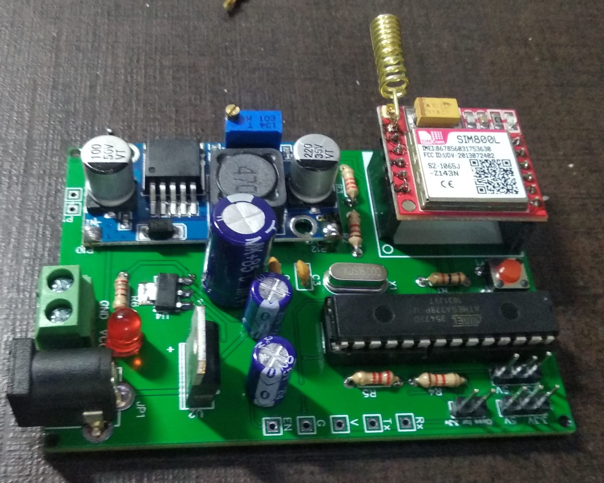

# Asset-Tracking-System-Using-GSM-and-UHF_RFID

### Description
This project was made for Coal India Pvt Ltd at Smart India National Competition 2019. A custom PCB was designed for making the final product small and compact as shown in the image below. For the controller we used Atmega328p. We used UHF RDIF for detecting the rf tags on the static assets of the company. Finally, we used a sim800L module for transmitting data to our server. 

